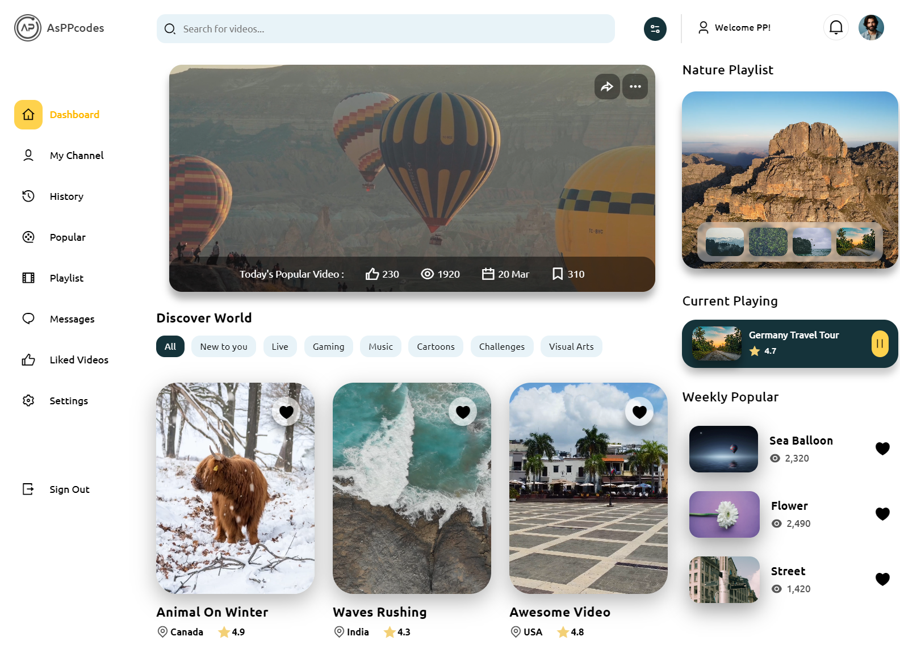

# Responsive Video Sharing Platform UI

🌟 Exploring the Ultimate Video Sharing Platform UI Design! 🎥💻

In this, we delve deep into the intricacies of designing a user-friendly and visually stunning UI for a video sharing platform. Whether you're a seasoned developer looking for inspiration or a newbie eager to learn, this has something for everyone!
With this, you'll get the idea to build and design key components of a video sharing platform.💡✨

If you like this, then feel free to give it a star.⭐

# Screenshot
Here we have project screenshot :

